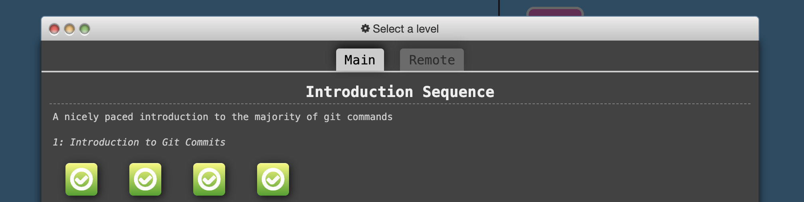
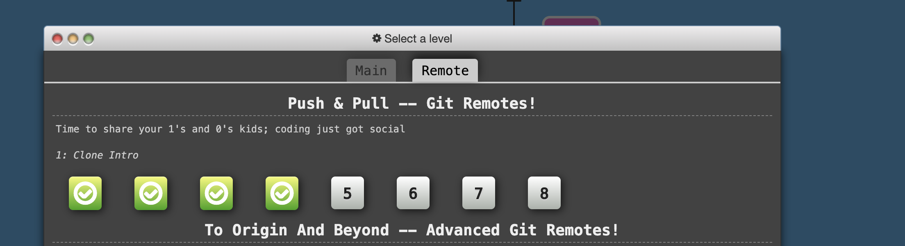

# Prise en main de git et gitlab

Comme vous l'avez vu dans le cadre du cours [SIP](https://wdi.centralesupelec.fr/1CC1000/GitAndGitLab), [**git**](https://git-scm.com/) est un logiciel de gestion de versions décentralisé, certainement le plus [populaire](https://news.softpedia.com/news/git-2-8-2-popular-source-code-management-system-released-with-over-18-bug-fixes-503591.shtml).

Comme c'est un outil fondamental pour tout travail de développement informatique en équipe, encore plus dans le contexte distanciel actuel, plusieurs montées en compétences sur cet outil seront faites  lors de cette première semaine des coding weeks.

## Les ressources disponibles

* Les slides du tutorial sont disponibles [ici](./Files/cours.pdf)
* De même, la vidéo du cours peut être consultée à tout moment [ici]()
* Un cheatsheet à consulter à tout moment [ici](.Files/cheatsheet.pdf)
* D'autres ressources intéressantes vous sont aussi conseillées :
	* un rapide tutorial [ici](http://rogerdudler.github.io/git-guide/index.fr.html).
	* [http://marklodato.github.io/visual-git-guide/index-en.html](http://marklodato.github.io/visual-git-guide/index-en.html)
	* [https://openclassrooms.com/fr/courses/1233741-gerez-vos-codes-source-avec-git](https://openclassrooms.com/fr/courses/1233741-gerez-vos-codes-source-avec-git)
	* ...

## Un peu d'entraînement

Avant de vous lancer dans le grand bain, nous vous proposons quelques séances d'entraînement à l'aide de l'outil [Learn Git Branching](https://learngitbranching.js.org/)

 **ATTENTION** : il ne s'agit clairement pas ici d'une course de vitesse mais de bien comprendre cet outil et les différentes commandes. N'hésitez pas à vous reporter aux différentes ressources mentionnées.

En particulier, nous vous demandons avant de passer à la suite de :

* Faire les 4 premiers challenges du niveau `Introduction Sequence` de l'onglet `Main`:  
	*  `1: Introduction to Git Commits`
	*  `2: Branching in Git`
	*  `3: Merging in Git`
	*  `4: Rebase Introduction`

Vous devriez avoir ceci comme écran cela après la résolution de ces 4 challenges. 

	

* De même, faire les quatres premiers challenges du niveau `Push & Pull -- Git Remotes!` de l'onglet `Remote`
	* `1: Clone Intro`
	* `2: Remote Branches`
	* `3: Git Fetchin'`
	*  `4: Git Pullin'`
	

Vous devriez avoir ceci comme écran cela après la résolution de ces 4 challenges. 

Quand vous avez terminé, vous pouvez faire le petit test de connaissance qui se trouve ici [TO DO].

 
 
 
 
 
 

 
 
 
 
 
 
 