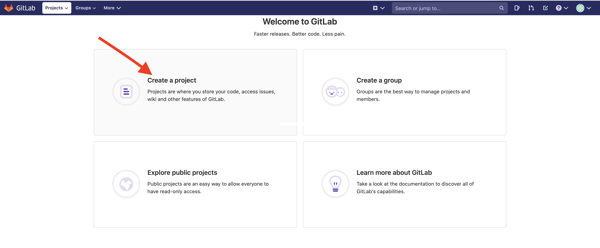
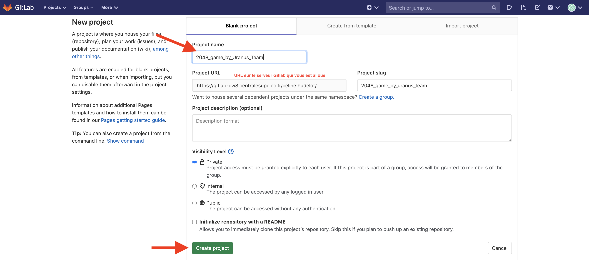
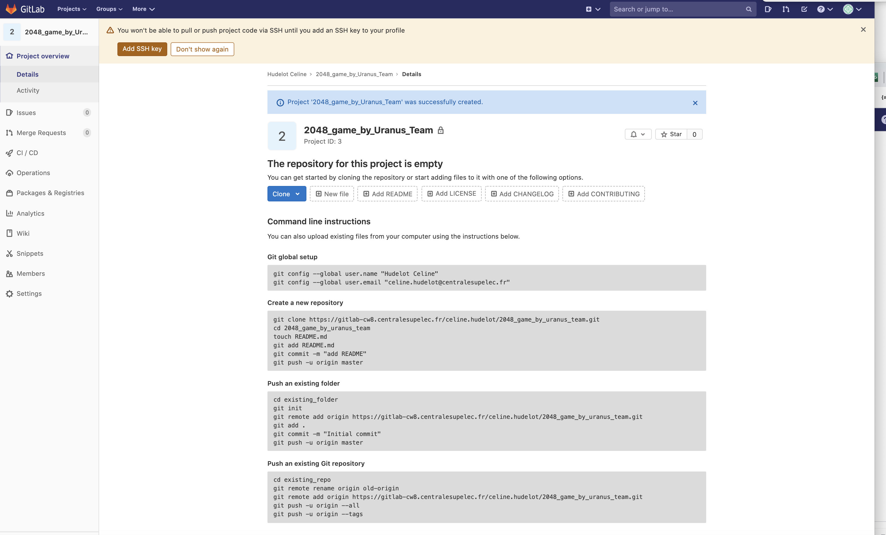
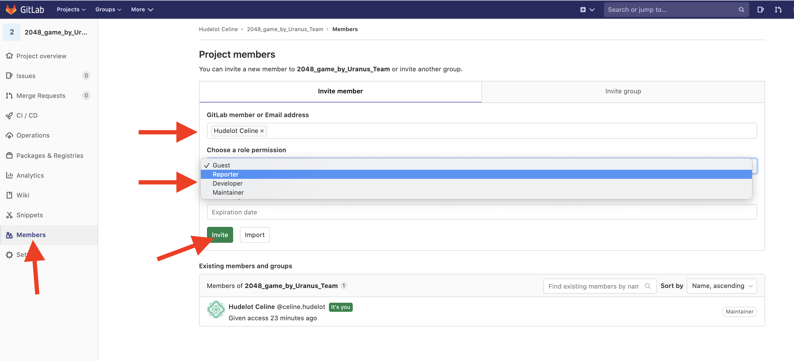
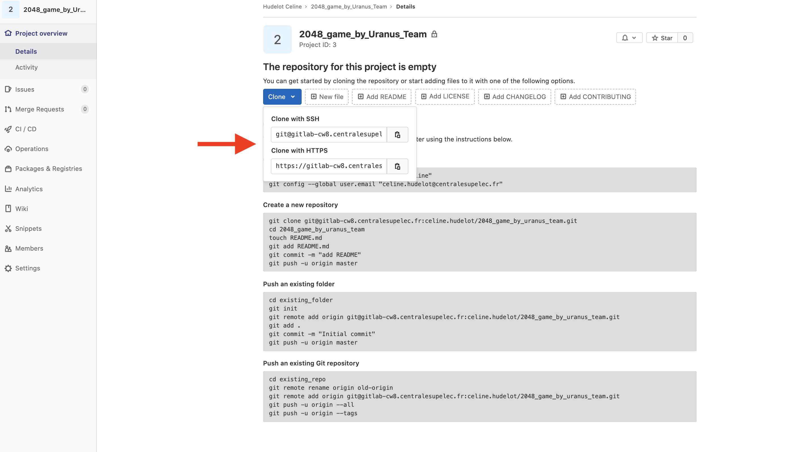
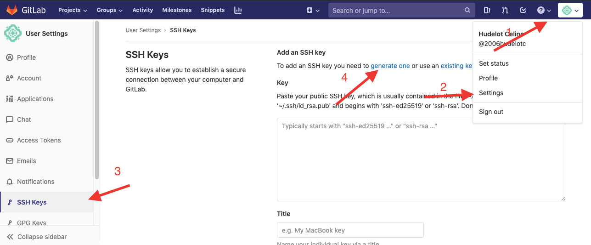
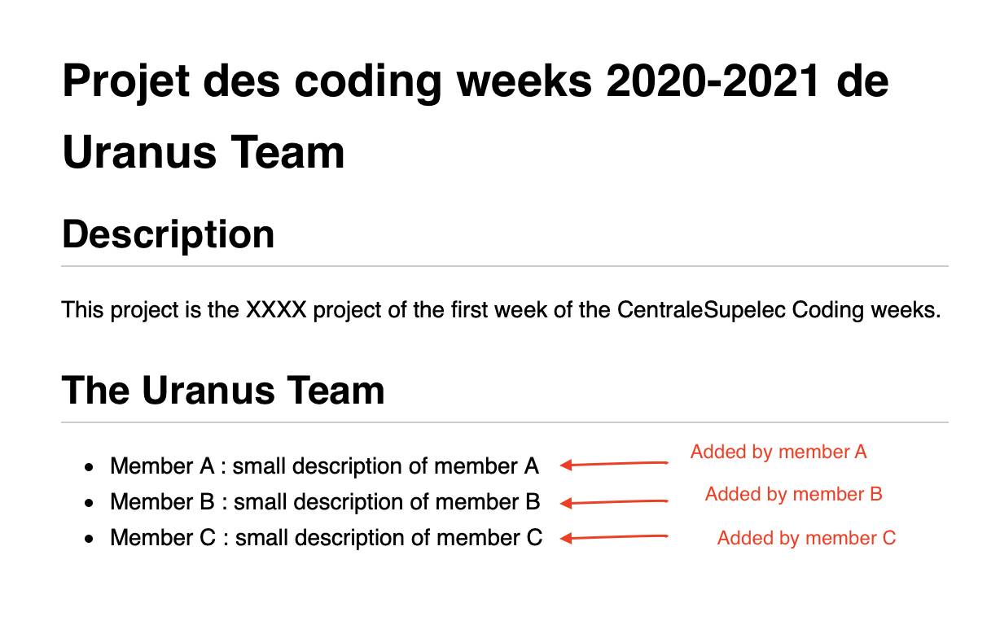
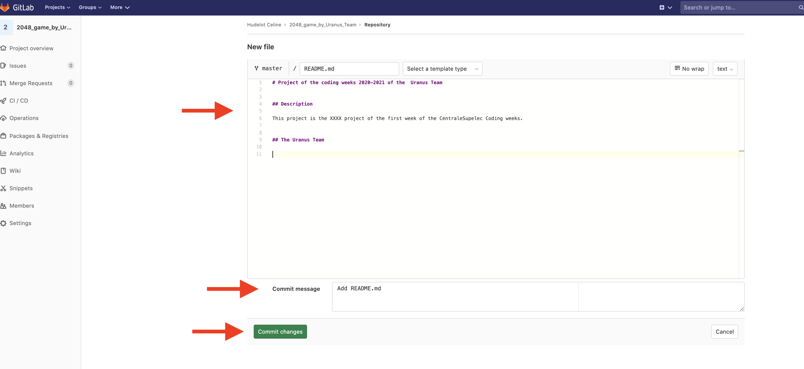
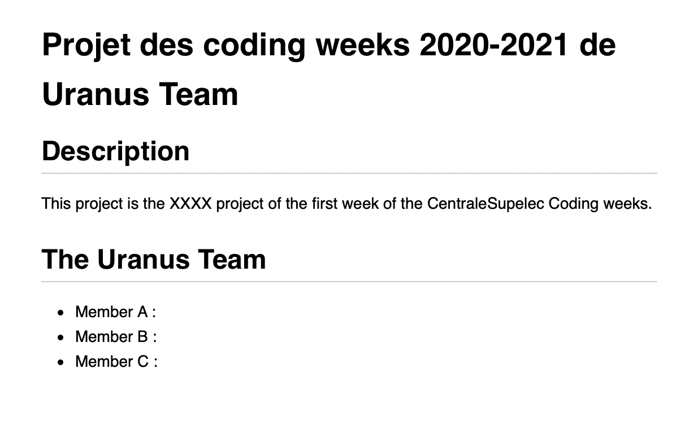
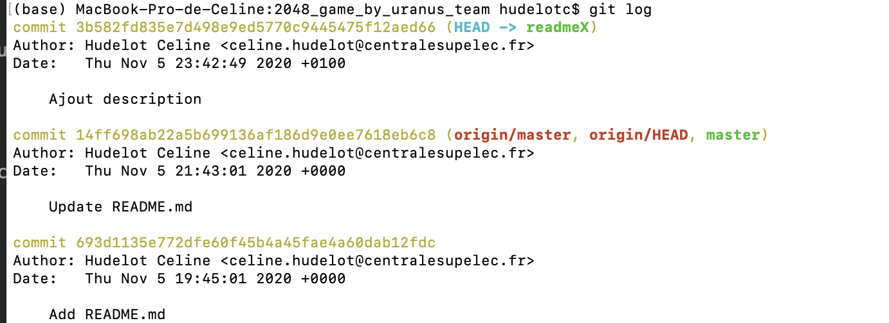

### Mise en place de Git et GitLab pour votre projet.


Comme vous devrez apprendre à le faire de manière systématique pour tout travail de développement informatique, vous devez donc passer votre projet **`nom_du projet`** sous Git pour pouvoir partager votre code et travailler en collaboration. 


### Premier travail : donner un nom à votre projet.

Une des premières choses à faire avant cette mise en place est de vous accorder sur le nom à donner à votre projet. Nous vous recommandons un nom intelligible, faisant référence au contenu de votre projet et permettant d'identifier votre équipe. Par exemple, si vous travaillez sur le projet `2048 game` et que vous avez décider d'appeler votre équipe `Uranus Team`, alors vous pourriez utiliser `2048_game_by_Uranus_team` comme nom pour votre projet. Nous allons supposer que c'est le cas dans la suite de ce tutorial.


### Création de votre dépôt (repository) Gitlab

Pour commencer, vous allez configurer git et gitlab pour pouvoir travailler en groupe sur ce projet. Supposons que votre groupe est composée de 3 personnes : **A** et **B** et **C**.


Nous allons considérer que c'est ici la personne **A** qui prend la main.


#### Consignes pour la personne **A**

Allez sur le serveur Gitlab qui vous est dédié et créez un dépôt (un projet) que vous nommerez `2048_game_by_Uranus_team`




Puis 




Vous devriez avoir ensuite une vue comme celle ci-dessous.




##### Ajouter une clé SSH si besoin

Si c'est le cas, la fenêtre jaune au dessus de la page vous alerte sur le fait que votre profil n'a pas de clé [SSH](https://fr.wikipedia.org/wiki/Secure_Shell) associée.

**Si c'est le cas** , il vous faudra cliquer sur le bouton `ADD SSH key` et suivre les instructions qui vous sont données afin d'associer une clé SSH à votre profil et vous permettre d'utiliser votre dépôt correctement.


##### Ajout de collaborateurs

Vous allez maintenant ajouter les autres membres de votre groupe, vos enseignants référents et la responsable (identifiant : `@celine.hudelot`) comme collaborateur de votre dépôt.

Pour cela, allez sur votre depôt GitLab et choisissez le menu `Members` dans la fenêtre de gauche. Ajouter votre binôme et votre enseignant comme collaborateur. Les différents membres de votre groupe seront *Maintainer* et vos enseignants et encadrants seront *Reporter*.




Les identifiants des personnes à ajouter vous seront communiquées le jour même via slack et/ou MsTeams.


#### Consignes pour tous les membres de groupe : personne **A**, **B** et **C**

Chacun membre du groupe va maintenant devoir copier (cloner) ce dépôt sur son ordinateur. 

+ Ouvrez pour cela un terminal (vous pouvez utiliser le [terminal intégré à Visual Studio Code](https://code.visualstudio.com/docs/editor/integrated-terminal) si vous le souhaitez).

+ Vérifiez que git est bien installé en tapant :

 `git --version`

+ Le numéro de version de git devrait apparaître.

+ Placez-vous maintenant dans le dossier (aussi appelé répertoire) où vous voulez créer votre projet à l'aide de la commande `cd`.

+ Allez sur Gitlab récupérer l'adresse web de votre dépôt.



Les instructions à faire vous sont données sur le site de votre dépôt Gitlab comme montré ci-dessous.


`

Il s'agit de : 

*  Les deux premières instructions vous permettent de configurer git avec votre nom et votre adresse mail 


`git config --global user.name "Your_Name Your_First_Name"`
`git config --global user.email "your email"`

* Ensuite, il s'agit de clôner le dépôt sur votre machine (ne le faites pas dans un dossier où il y a déjà des fichiers...) en tapant dans le répertoire choisi : 

`git clone l_adresse_de_votre_depot`

Un nouveau dossier devrait apparaître vide pour le moment car votre dépôt est vide mais si ce n'était pas le cas, ce dossier comprendrait le contenu de votre dépôt.


*   Si vous obtenez l'erreur `Couldn't find ref remote master`, allez sur votre dépôt Gitlab (dans le navigateur web) et créez un fichier quelconque.


* Si vous obtenez une erreur de certificat (qui sert à crypter vos échanges entre votre ordinateur et Gitlab), vous avez deux solutions possibles :
	*  Solution 1: désactiver SSL
	*  Solution 2: créer une paire de clés SSH (une privée et une publique)

### Solution 1: désactiver SSL


A la place d'utiliser la commande `git clone`, utilisez ces commandes :

```
mkdir nom_de_votre_projet # attention, aucun dossier "game2048" ne doit déjà exister
cd nom_de_votre_projet
git init
git remote add origin "ladresse_du_depot_qui_commence_par_https"
git config http.sslVerify false
git pull origin master # cela peut prendre un peu de temps
```

### Solution 2 : créer une paire de clés SSH (une privée et une publique)



Lorsque vous générez la clé, laissez tous les champs vides. Pressez juste "Entrée" à chaque fois.

Vous pouvez ensuite afficher votre clé publique via (attention sur Windows, utilisez le Git bash ou le PowerShell):

 `cat ~/.ssh/id_rsa.pub `
 
 
Copiez-la ensuite dans le grand rectangle.

Vous pouvez maintenant faire vos commits et "pusher" vos versions sur Gitlab.

### Rappel des quelques commandes git utiles

Un mémo des commandes git est disponible [ici](https://centralesupelec.edunao.com/pluginfile.php/65396/course/section/4378/cheatsheet.pdf)

Quelques commandes très utiles :

+ afficher les fichiers qui sont sélectionnés pour être commités et ceux qui ne le sont pas.

```
git status
```

+ afficher les modifications depuis le dernier commit

```
git diff
```
+ ajouter un fichier dans la zone de transit

```
git add my_file_name
```

+ créer un commit à partir des fichiers dans la zone de transit.
 
```
git commit -m "A message that describes the commit"`
```


Il s'agit d'une sauvegarde (d'une version) de votre code. Partager votre code revient à transmettre des commits.

+ envoyer vos commits sur le serveur

```
git push origin master 
```

+ récupérer les commits du serveur

```
git pull origin master 
```

## <span style="color: #26B260">A ce stade, tous les membres du projet doivent avoir une copie locale du projet hébergé sur GitLab par la personne A </span> 


### Un premier travail de code collaboratif

Pour vous familiariser avec le pipeline *classique* qu'il faut normalement suivre pour collaborer sur un projet de développment logiciel, nous allons faire une premier exercice qui va consister à écrire le fichier `README.md` de votre projet de manière collaborative.

Au passage, le fichier `README.md` est une fichier très important qui permet notamment de décrire le informations utiles sur les autres fichiers du même répertoire. Vous pouvez prendre le temps de lire [ce tutorial](https://www.makeareadme.com/) qui est très bien fait et qui vous servira pour votre projet.


Ici, votre objectif est de construire le fichier README de votre projet, selon le modèle décrit ci-dessous.


`
 
 
Pour cela, nous vous conseillons de suivre les étapes suivantes.

* Premièrement, l'un des membres de l'équipe va initier le fichier README.md depuis GitLab, en utilisant l'éditeur de ce dernier. L'idée est de compléter le fichier jusqu'à la description des membres de l'équipe.


`

Votre fichier devrait donc être proche de celui ci-dessous, avec les descriptions des membres non complétées.

`

Ce que vous venez de faire est équivalent à une modification de votre repo distant, avec l'ajout d'un fichier et son commit. Notamment, les actions faites sont équivalentes à 

```
git add README.md
git commit -m "ADD README.md"
```

*  **Action pour tous les membres de l'équipe** : Vous venez de modifier votre dépôt distant et donc l'ensemble de vos dépôts locaux ne sont plus synchronisés avec ce dépôt distant. Il est donc nécessaire, avant tout action, de resynchroniser votre repo local avec le distant. 

Placez  vous à la racine de votre dépôt local et tapez la commande 

```
git pull
```

Cette dernière permet de télécharger les nouvelles modifications effectuées et déposées, par d'autres personnes, sur le serveur. Cette commande revient en fait à appeler deux commandes différentes :  `git fetch`, qui s’occupe du téléchargement des nouveaux commits, et  `git merge`, qui fusionne les commits téléchargés issus de la branche du serveur dans la branche de votre repo local.

Comme vous ne devriez avoir fait aucune modification, cette mise à jour est une mise à jour simple.


* **Action à faire par chaque membre de l'équipe sur son repo local**

Vous allez maintenant chacun travailler de votre côté. On pourrait typiquement imaginer ici que vous travaillez chacun à une fonctionnalité de votre projet. Pour cela, vous allez utiliser le coeur même de Git, la notion de **branche**. C'est le moyen de travailler en parallèle sur des nouvelles fonctionnalités d'un même projet, tout en permettant de préserver votre projet initial. C'est typiquement comme si vous aviez une copie de votre projet quelque part vous permettant de tester vos idées avant de les intégrer à votre vrai projet.

Pour commencer, vous pouvez voir toutes vos branches avec la commande ci-dessous :

```
git branch

```

Vous verrez normalement uniquement « master » :

```
$ git branch
* master
```
Chacun de votre côté, vous allez maintenant créer une branche s'appellant `readmeX` avec `X` le nom de la personne. Par exemple, si la personne A s'appelle Martin, il va créer la branche s'appelant `readmeMartin`.

Pour cela, il suffit de faire :

```
git branch readmeX
```

Vous pouvez à nouveau voir les branches de vos projets avec la commande 

```
git branch

```

Cette fois-ci vous voyer deux branches, `master` et `readmeX` mais le `*` montre que vous êtes toujours sur la branche `master`.

```
$ git branch
* master
  readmeX
```

Pour passer sur la branche `readmeX`, il est donc nécessaire de faire la commande 

```
git checkout readmeX
```

Vous êtes maintenant sur la bonne branche et vous pouvez le vérifier en refaisant la commande `git branch` dont le résultat devrait être 

```
$ git branch
  master
* readmeX
```

Vous allez maintenant pouvoir apporter une modification au fichier `README.md` depuis cette branche.

Avec un éditeur, comme par exemple VSCode, ouvre le fichier README.md et compléter la partie description  vous correspondant et sauvegarder le fichier.

Il faut maintenant faire un commit de vos modifications. 
Vous pouvez d'abord commencer par utiliser la commande `git status` pour voire quels fichiers ont été mofifiés.

```
$ git status
On branch readmeX
Changes not staged for commit:
  (use "git add <file>..." to update what will be committed)
  (use "git restore <file>..." to discard changes in working directory)
	modified:   README.md

no changes added to commit (use "git add" and/or "git commit -a")
```

Pour commiter vos changement sur la branche `readmeX` il faut donc faire les commandes :

```
git add README.md
git commit -m "Add of my description"
``` 

A ce stade, vous pouvez aussi faire la commande 

```
git log
```
qui vous permettra d'affichier l'historique de vos commits.
 



Vous pouvez maintenant pousser vos changements (et donc votre branche) sur le repo distant avec la commande.

```
 git push --set-upstream origin readmeX
```
L'option `--set-upstream` permettra que la branche existante fasse le suivi de la branche distante

## <span style="color: #26B260">A ce stade, tous les membres du projet devraient avoir créé leur propre branche, fait le changement demandé et répercuté la  branche sur le repo distant, sur lequel vous devriez observer plusieurs branches maintenant </span>


 
 
 et
 
  
  
  
A ce stade, vous pouvez aussi mettre à jour votre dépôt local du distant avec la commande 

`git pull`
 
  
  
 
### Fusionner les changements avec `git merge`

Lorsque vous avez fini de travailler sur une branche et que celle-ci est concluante, il faut d'usage de fusionner cette branche vers `master` avec la commande  git merge.
C'est une étape qui peut assez facilement générer des conflits, notamment si vous avez modifié les mêmes lignes du fichier `README.md` 

Revenez à votre repo local. Vous pouvez par exemple faire un petit bilan de votre repo avec la commande 

```
git status
```
*  Utiliser la commande adéquate pour savoir sur quelque branche de votre repo vous vous trouvez.
*  Passer sur la branche `master` avec la commande 

`git checkout master`

* Vous pouvez maintenant intégrer le travail que vous avez fait dans la branche `readmeX` avec la commande 

```
git merge readmeX 

``` 

Votre branche  `readmeX` ne servant plus à rien, vous pouvez la supprimer avec la commande

```
git branch -d readmeX
```

Il vous reste ensuite à pousser vos modifications vers le dépôt distant.

### En cas de conflit


 
 
 
 


