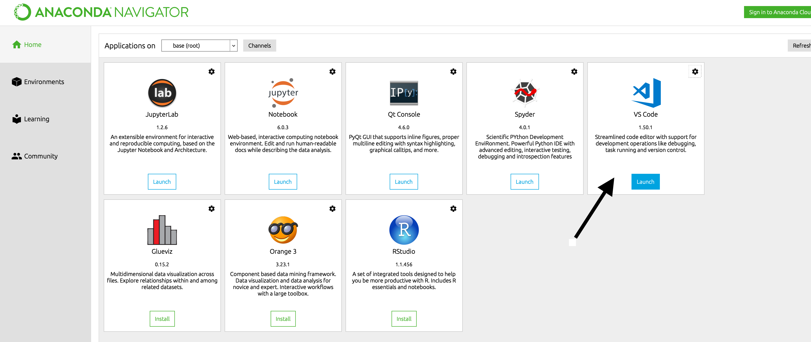
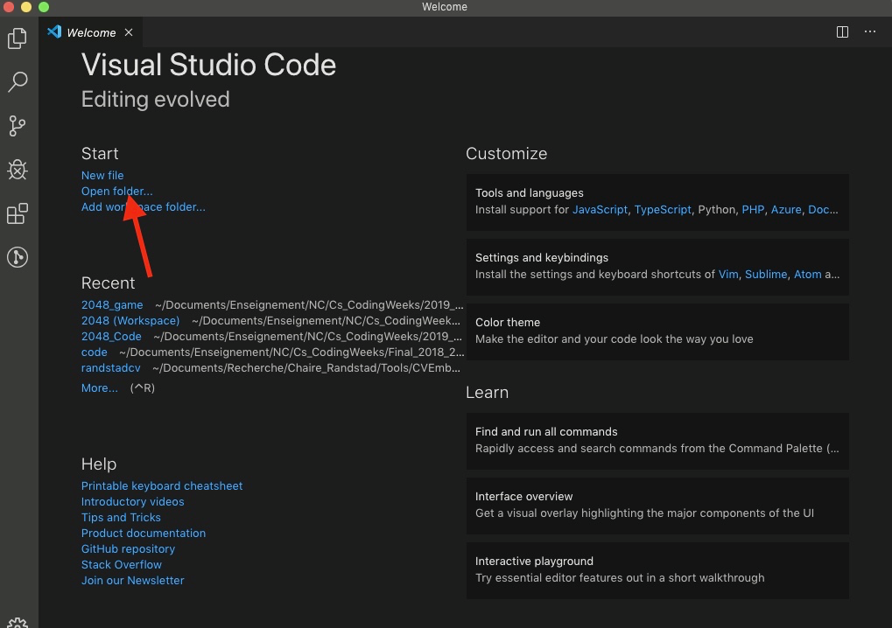
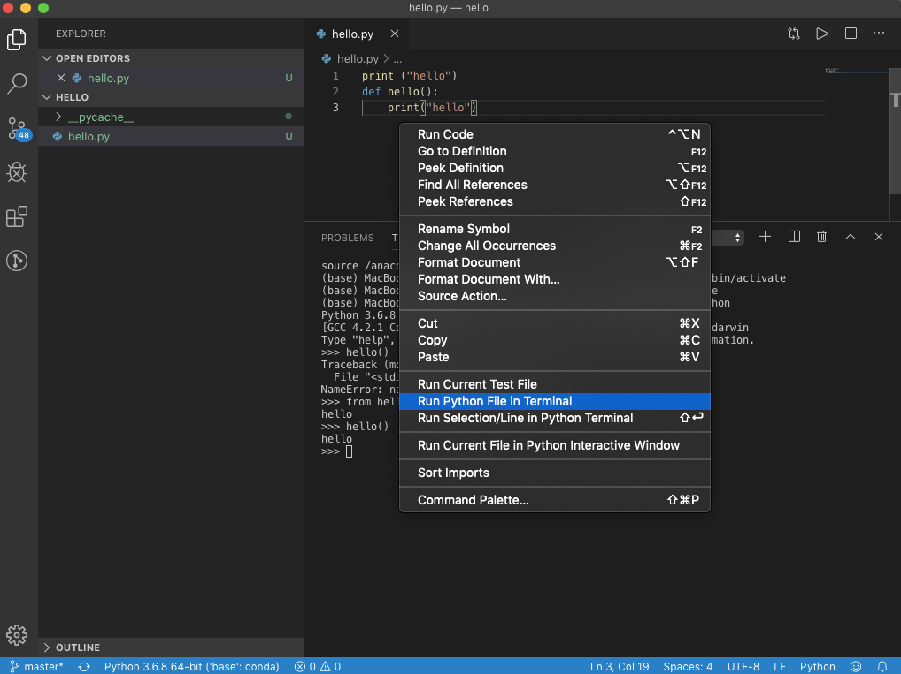
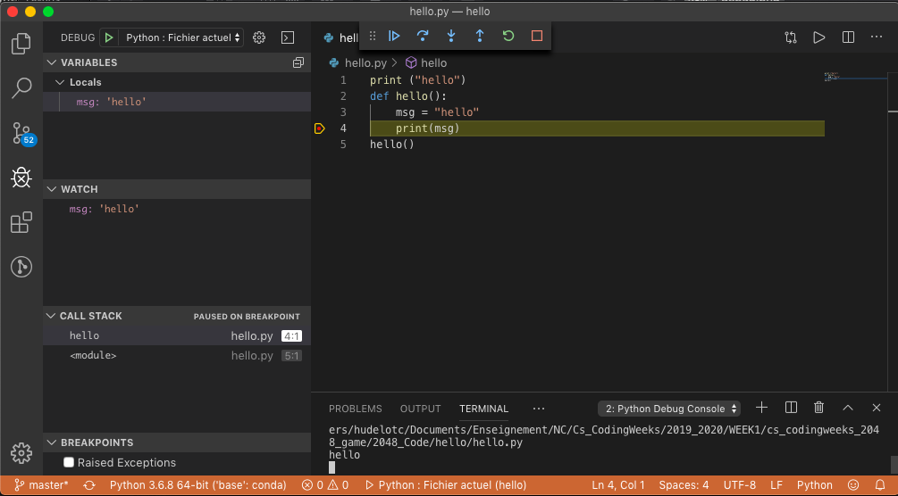

# Visual Studio Code (ou VSCode)

[Visual Studio Code](https://code.visualstudio.com/) (à ne pas confondre avec Visual Studio) est l'éditeur de code qui s'est le plus popularisé ces dernières années. Il est très adapté à python et au développement web et, surtout, il est très facile à prendre en main et à comprendre.

Vous devriez normalement avoir pris connaissance de Visual Studio Code lors du cours SIP. Si ce n'est pas le cas, un très bon tutoriel de VSCode pour python est disponible [ici](https://realpython.com/python-development-visual-studio-code/) ou sur le [site officiel](https://code.visualstudio.com/docs/python/python-tutorial).

La suite du document est un survol rapide de cet outil.

## Installation et configuration

Pour l'installation, plusieurs solutions.

* Si vous avez installer Anaconda, vous avez aussi directement accès à VSCode via le Anaconda Navigator.

* Sinon, il suffit d'aller sur ce [site](https://code.visualstudio.com/) et de suivre les instructions.

Visual Studio Code est un éditeur extensible qui supporte de nombreux langages de programmation à partir d'un principe d'extension et donc dans notre cas, il convient d'installer l'[extension Python](https://marketplace.visualstudio.com/items?itemName=ms-python.python). Il est aussi possible de directement passer par l'extension d'[Anaconda](https://marketplace.visualstudio.com/items?itemName=ms-python.anaconda-extension-pack).

## Prise en main : un éditeur orienté dossier

Visual Studio Code est un éditeur de texte orienté dossier, c'est à dire qu'il est conçu de sorte à travailler sur des dossiers, qu'il considère comme un projet. 

Pour créer un projet, il suffit donc juste d'ouvrir un dossier depuis VSC.

Par exemple, pour créer le projet HelloWorld en python, il vous faudra :
 
 + Ouvrir en le créant eventuellement un dossier `helloworld`
 + Un fois ce dossier créer, créer et ajouter à ce dossier un fichier `helloworld.py` comme illustré [ici](https://code.visualstudio.com/docs/python/python-tutorial#_create-a-python-hello-world-source-code-file)

## Execution

L'exécution d'un programme, comme par exemple le programme `helloworld.py` se fait en executant la commande `Run Python File in Terminal` accessible par un clic droit depuis la fenêtre d'édition.

D'autres options sont possibles comme :
 
 + la sélection d'une ou plusieurs lignes, puis la commande `Maj+Entrée` ou un clic droit et `Run Selection/Line in Python Terminal`. Cette commande est pratique pour tester seulement une partie d'un fichier.
 + Dans la palette de commandes `(⇧⌘P)`, sélection de la commande `Start REPL` qui ouvre un terminal REPL (fenêtre interactive) pour l'interpréteur Python sélectionné. Dans la REPL, vous pouvez ensuite saisir et exécuter les lignes de code une à la fois.
 + L'extension [coderunner](https://marketplace.visualstudio.com/items?itemName=formulahendry.code-runner) est aussi une extension intéressante pour l'exécution de code et notamment pour ceux qui aiment bien les boutons d'exécution.
  
## Déboguer
 
 
VS Code offre plusieurs fonctionnalités intéressantes pour dégoger votre code :

 + L'inspection des variables
 + Les points d'arrêts
 + L'inspection de la pile d'appel

Le Degogueur peut être tout simplement lancé avec la commande `F5`.

Les fonctionnalités de base sont décrites [ici](https://code.visualstudio.com/docs/python/python-tutorial#_configure-and-run-the-debugger).

## Intégration de Git 

  
Il est aussi possible d'intégrer Git directement à Visual Studio Code. Si vous souhaitez le faire, vous pouvez regarder ce [tutoriel](https://code.visualstudio.com/docs/editor/versioncontrol).
 
 