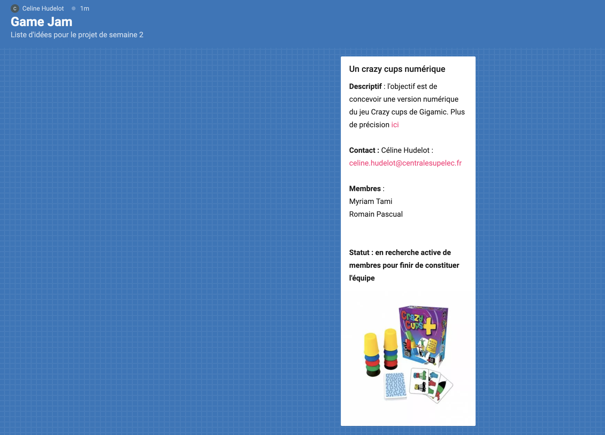

# Coding Weeks : Concernant les projets de semaine 2

La fin de la semaine 1 approche !!!
Nous espérons qu'elle aura atteint son objectif : vous donner les moyens de faire votre projet de semaine 2.

## Quelques informations concernant les projets de semaine 2 :

Comme pour cette semaine, les projets se feront en groupe de 4 à 6 personnes. Il n'est **absolument pas obligatoire de garder le même groupe que pour la semaine 1**. Dans l'idéal ces groupes devront être constitués dans votre groupe de coding weeks (ceux de Myway) mais nous pourrons accepter, à la marge, des groupes mélangés si la logique est respectée (typiquement si le même projet de semaine 1 a été effectué)

Le sujet de semaine 2 est **libre**, c'est à vous de le déterminer, en fonction du thème général qui vous a été proposé. Nous attirons aussi votre attention sur le fait que ce projet :

* ne sera donc pas du tout guidé et donc ce sera à vous de faire **le travail d'analyse, de conception et de découpage de votre projet en Sprints** pour atteindre au moins un **MVP** en fin de semaine. Ce travail est le premier **Jalon** de votre projet de semaine 2.
* Ce projet sera aussi beaucoup moins encadré que le projet de semaine 1. Vous serez vraiment dans une logique *projet* cette semaine là, d'où l'importance d'avoir bien compris les choses et les problèmes rencontrés en semaine 1 et de devenir plus autonome sur la résolution des problèmes.
* Un suivi sera mis en place pour nous assurer de la bonne avancée de votre projet notamment en nous appuyant sur une liste de jalons comme vous l'avez vu en semaine 1. Nous garderons aussi une assistance pour les problèmes techniques mais de manière beaucoup moins soutenue.

 
Pour pouvoir profiter au maximum des 4 jours de la semaine 2 pour concevoir et implémenter votre projet, nous prendrons un peu de temps, à la fin de la première semaine pour la constitution des groupes. Ce travail sera fait vendredi après midi. Pour permettre d'avancer sur ce travail, nous vous proposons :

*  La mise en place de Padlets, des murs virtuels, qui serviront de banque à idée de projets. Pour certains groupes, quelques sujets ont déjà été proposés par des partenaires de l'école. Ces Padlets seront accessibles depuis vos espaces MsTeams respectifs. Pour proposer un sujet de projet aux membres de votre groupe, il vous suffira d'ajouter une carte sur le mur donnant les indications suivantes :
	* un titre provisoire
	* un rapide descriptif et un eventuel lien vers un descriptif plus long.
	* le nom et le contact de la personne proposant le projet
	* le status du projet : complet ou en recherche de membres

Pour vous donner une idée, voici un exemple ci-dessous.

*  Nous vous donnons aussi une liste de sujets proposés par vos camarades des années passées pour vous donner des idées de ce qu'il est possible de faire en une semaine. Evidemment, c'est une liste informative, essayez de réfléchir à vos propres sujets !

Bon travail ! 

 
 
