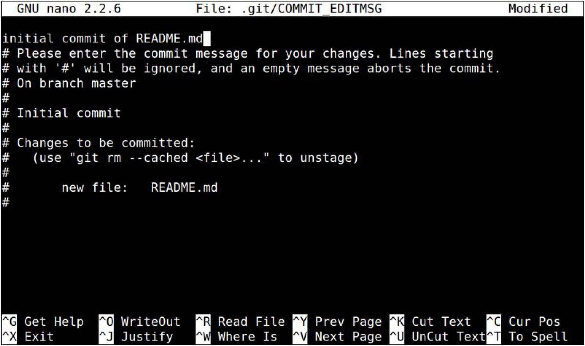
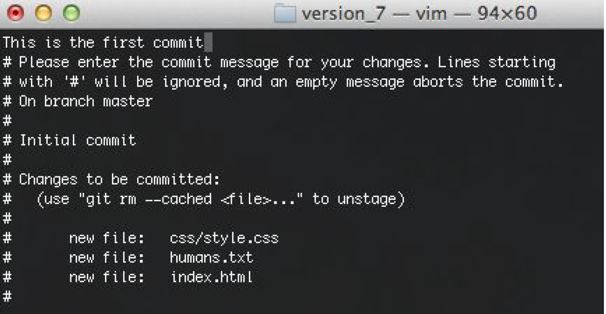

# Cheatsheet Bash

(D'après le tutorial fait par la promotion INFONUM 2021)

On utilise une interface appelée shell pour communiquer entre l'utilisateur et le système
d'exploitation. Bash est un shell très répandu. L'utilisateur interagit avec le shell via une CLI
(Command Line Interface, ou Interface en Ligne de Commande), c'est-à-dire en tapant des lignes de
code qui contiennent les commandes que le système d'exploitation doit exécuter. Un terminal est un
programme qui ouvre une fenêtre graphique dans laquelle les utilisateurs peuvent taper ces
commandes.

## Ouvrir un shell
* VSCode contient un terminal intégré (View > Terminal), qui donne accès au shell Bash.
* Windows permet d'accéder au shell cmd, ou au shell PowerShell
* Sous Mac, c'est Terminal, pour accéder au shell Bash
*  Sous Ubuntu, le Terminal permet de lancer le shell Bash
*   Si vous avez une distribution plus exotique, vous n'avez probablement pas besoin de cette
section du tuto

## Commandes
Tous ces terminaux ouvrent des shells différents ; chaque shell a des différences subtiles dans les
commandes qu'ils sont capables d'interpréter. Néanmoins, les commandes suivantes sont utilisables
dans n'importe quel terminal :

* `pwd` : donne le nom du dossier parent. Utile pour comprendre où vous avez mis votre dossier
de travail.
* `cd folder_name` : "change directory". Permet de se déplacer dans l'arborescence de fichiers.
	* Exemple : `cd Documents` pour rentrer dans le dossier "Documents" ; `cd ..` pour remonter
d'un cran dans l'arborescence ( retourner au dossier parent)
* `ls` : afficher les dossiers et fichiers du répertoire courant. Utile pour vérifier pourquoi votre
autocomplete ne marche pas, ou si vous avez correctement réussi à bouger ou créer des fichiers
* `mkdir folder_name` : créer un dossier
* `touch file_name` : créer un fichier
* `mv path/towards/folder_name new/path/towards/folder_name new/path/please/folder_name` : déplacer un dossier.

## :point_right: J'ai ouvert nano

nano est un éditeur de texte minimaliste. 

Quelques commandes de base :

+ `ctrl+o` pour quitter en sauvegardant
+ `ctrl+x` pour quitter. S'il y a des changements nano demandera si on veut sauvegarder

## :point_right: J'ai ouvert vim (ce qui est très probable lors d'un commit git)

Vim est un éditeur en ligne de commande. On le reconnaît souvent au mot-clé "vim" dans le header (voir
image), et à l'absence des aides de navigation en bas de l'écran (contrairement à nano, voir image plus
haut). La plupart des commandes sont tapées directement, pas besoin de la touche 'entrée' pour les
valider.

* `i` : entrer en mode insertion (pour écrire du texte). Il y aura marqué "insert" en bas.
* `esc` : sortir du mode insertion
* `:x` ou `:wq` pour quitter en sauvegardant
* `:q` pour quitter sans sauvegarder

## Petit exercice d'entrainement

Pour vous entrainez aux commandes de base, faites ce petit exercice d'entrainement.

* Ouvrir un terminal : vous pouvez soit prendre le terminal intégré à VS Code soit prendre un terminal propre de votre OS (Terminal sur macOS or Linux, Git Bash sur Windows)
* Quel est votre répertoire courant ? (:beginner: indice, commande `pwd`)
* A l'aide de la commande `cd`, se placer dans son répertoire de travail (très souvent le répertoire `~/Documents`).
* Afficher le contenu du répertoire (:beginner: indice, commande `ls`)
* Créer un nouveau répertoire `TestBash` dans votre répertoire courant (:beginner: indice, commande `mkdir`)
* Vérifier que ce répertoire est bien créé en réaffichant le contenu de votre répertoire courant.
* Créer un nouveau fichier `HelloWorld.txt` dans ce répertoire (:beginner: indice, commande `touch`).
* Editer le avec le contenu de votre choix (ici vous pouvez choisir de la faire avec VSCode comme éditeur mais c'est aussi une bonne occasion de tester `vim` ou `nano`)
* Tester maintenant les commandes ci-dessous :
	* 	`ls -a`
	*  `ls -l`
	*  `ls -t`
Que font-elles ? (:beginner: [indice](http://www.commandeslinux.fr/commande-ls/))
* Copier le contenu de votre fichier `HelloWorld.txt` dans le fichier `HelloWorldbis.txt` (:beginner: indice, commande [`cp`](https://www.commandeslinux.fr/commande-cp/))
* Vérifier votre action
* Supprimer le fichier `HelloWorldbis.txt` (:beginner: [indice](https://www.commandeslinux.fr/commande-rm/))

Une fois ce petit exercice terminé, vous pouvez maintenant faire le petit test associé sur Edunao qui se trouve [ici](https://centralesupelec.edunao.com/mod/quiz/view.php?id=73157)

