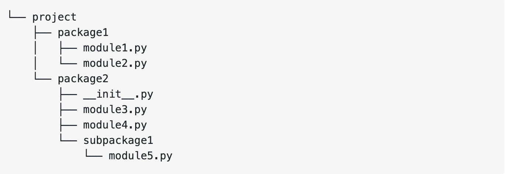
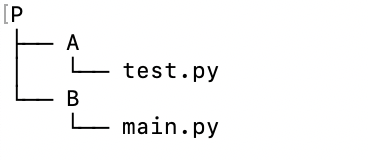

# Import de fichiers et modules en python

Comme vous allez le découvrir assez rapidement, nous allons beaucoup insister sur la structuration de votre code lors de ces deux semaines.

En particulier, nous allons beaucoup utiliser la notion de `modules` et `packages` qui sont deux notions fondamentales en python et qui facilitent la **[programmation modulaire](https://en.wikipedia.org/wiki/Modular_programming)**. 

Nous aurons l'occasion de revenir de manière détaillée sur les principes de bonne structuration d'un projet python. Ici, nous vous rappelons rapidement ce que sont les modules et paquets (packages) en python.

## Modules

Un module est tout fichier constitué de code Python (c’est-à-dire tout fichier avec l’extension `.py`) importé dans un autre fichier ou script.

Les modules permettent la séparation du code et donc son organisation. Vous le verrez cette semaine, il est très courant de séparer son code en différents fichiers qui vont contenir des fonctionnalités et parties cohérentes du programme final. Cela facilite la compréhension générale du code mais aussi sa réutilisation, maintenance et c'est d'autant plus important dans le cadre du travail en équipe.

Vous connaissez d'ailleurs un certain nombre de modules, comme les modules standards qui ne font pas partie du langage en soi mais sont intégrés automatiquement par Python : [`math`](https://docs.python.org/fr/3.5/library/math.html), [`random`](https://docs.python.org/3/library/random.html) par exemple.


###  Création d'un module

En Python, la création d'un module est très simple. Il suffit d'écrire un ensemble de fonctions (et/ou de constantes) dans un fichier, puis d'enregistrer ce dernier avec une extension .py (comme n'importe quel script Python). 


#### Exemple 

Créer un fichier dans votre repertoire de travail nommé `puissance.py`  et qui va définir 2 fonctions : `carre()` et `cube()`. Un tel fichier est appelé un module et il va pouvoir être importé dans un autre fichier, et en particulier dans le fichier qui contient le programme principal.

```
def carre(valeur):
    resultat = valeur**2
    return resultat

def cube(valeur):
    resultat = valeur**3
    return resultat
```

Il est maintenant possible d’utiliser dans un autre programme les fonctions qui ont été définies dans le module `puissance.py`. Pour cela, il faut importer les fonctions à partir du module.


```
from puissance import carre

a = 5
u = carre(a)
print("le carre vaut", u)
```

Le fichier `puissance.py` doit être dans le même répertoire que ce programme (ou bien se trouver dans le « path » de Python).

Pour l'importation des fonctions du modules, vous pouvez soit :

* Importer explicitement une ou les deux fonctions

```
from puissance import carre
```

```
from puissance import carre, cube
```

* Tout importer

```
from puissance import *
```

** :heavy_exclamation_mark: L’importation de toutes les fonctions avec * est fortement déconseillée. En effet, elle ne permet pas d’avoir une vision claire des fonctions qui ont été importées. Ceci est donc une source potentielle d’erreurs.**

Une bonne manière de faire est de lui donner un alias

```
import puissance as pu
a = 5
u = pu.carre(a)
print("le carre vaut", u)
v = pu.cube(a)
print("le cube vaut", v)
```

## Packages

Quand on a un grand nombre de modules, il peut être intéressant de les organiser dans des dossiers. Un dossier qui rassemble des modules est appelé un **package** (paquet en français). Le nom du package est le même que celui du dossier. Par exemple, on crée un dossier package1 dans lequel on place le fichier module1.py suivant :

```
def fonction1(a):
    return a**2
```

On peut ensuite utiliser la fonction fonction1() définie dans module1.py, en important package1.module1 comme dans l’exemple qui suit :

```
import package1.module1

u = package1.module1.fonction1(3)
print("u vaut", u)

```

Avant Python 3.5, pour être un package, un répertoire devait contenir un fichier `__init__.py`. Ce n’est plus obligatoire aujourd’hui, mais c’est toujours utile. Quand un package est importé, c’est en fait son module `__init__ ` qui l’est.


## Comment fonctionne import ?

Que se passe t'il lors de l'exécution de l'instruction `import mod1`?

La première chose que fait Python est de rechercher le nom `mod1` dans `sys.modules`. Il s'agit d'un cache de tous les modules qui ont été précédemment importés.

Si le nom n'est pas trouvé dans le cache des modules, Python effectuera une recherche dans une liste de modules intégrés. Ces modules sont préinstallés avec Python et se trouvent dans la bibliothèque standard de Python. Si le nom n'est toujours pas trouvé dans les modules intégrés, Python le cherche alors dans une liste de répertoires définie par `sys.path`. Cette liste inclut généralement le **répertoire courant**, qui est recherché en premier.

Lorsque Python trouve le module, il le lie à un nom avec une portée locale. Cela signifie que `mod1` est maintenant défini et peut être utilisé dans le fichier courant sans déclencher une exception de type `NameError`.

Si le nom n'est jamais trouvé, vous obtiendrez une erreur `ModuleNotFoundError`. 

Si vous voulez en savoir plus, vous pouvez lire la documentation officielle [ici](https://docs.python.org/3/reference/import.html).


## Imports absolus


Une importation absolue spécifie la ressource à importer en utilisant son chemin complet depuis le dossier racine du projet.

Prenons l'exemple du projet  ci-dessous



Un répertoire, `project`, contient deux sous-répertoires, `package1` et `package2`. Le répertoire `package1` contient deux fichiers, `module1.py` et `module2.py`.

Le répertoire `package2` contient trois fichiers : deux modules, `module3.py` et `module4.py`, et un fichier d'initialisation, `__init__.py`. Il contient également un répertoire, `subpackage`, qui contient à son tour un fichier, `module5.py`.

Supposons ce qui suit :

* `package1/module2.py` contient une fonction, `function1`.
*  `package2/subpackage1/module5.py` contient une fonction, `function2`.

L'import absolu peut alors être fait de la manière suivante  en considérant que le répertoire courant est celui du projet :

```
from package1 import module1
from package1.module2 import fonction1
from package2.subpackage1.module5 import fonction2

```

## Imports relatifs

La syntaxe d'une importation relative dépend de l'emplacement actuel ainsi que de l'emplacement du module, du paquet ou de l'objet à importer.

Si on reprend l'exemple du dessus, la syntaxe pour importer la `fonction1` dans le fichier `package1/module1.py` est  

```
# package1/module1.py

from .module2 import function1

```

La syntaxe pour importer la  `fonction2` dans `package2/module3.py` est :

```
# package2/module3.py

from .subpackage1.module5 import fonction2


```

:warning: Les importations absolues sont préférées car elles sont assez claires et directes. Il est facile de savoir exactement où se trouve la ressource importée, simplement en regardant la déclaration.*


## Execution en présence de modules et packages.

Supposez que vous avez l’arborescence suivante dans votre projet:

* Un répertoire P qui contient tout votre projet.
* Un répertoire A dans P qui contient le fichier `test.py` (qui contient la fonction `my_test()`)
* Un répertoire B dans P qui contient le fichier `main.py`




Vous voulez importer dans `main.py` la fonction `my_test()`.

Dans le fichier `main.py` vous devez donc écrire :
```
from A.test import my_test
```


Pour exécuter le fichier `main.py`, il est préférable d’utiliser directement le terminal,
sinon si vous faites un click sur la flèche verte, cette exécution sera faite
relativement au répertoire où `main.py` se trouve (à savoir B), donc le `import A.test` ne sera pas trouvé (c.f. ci-dessus).

Ouvrez le terminal, placez-vous dans le répertoire racine `P` du projet  et tapez la commande suivante :
```
python -m B.main
```

De cette manière, python utilisera le répertoire `P` comme répertoire de travail. Toute référence qu’il trouve (par ex., `from A.test import my_test`) sera interprétée relativement à ce répertoire.